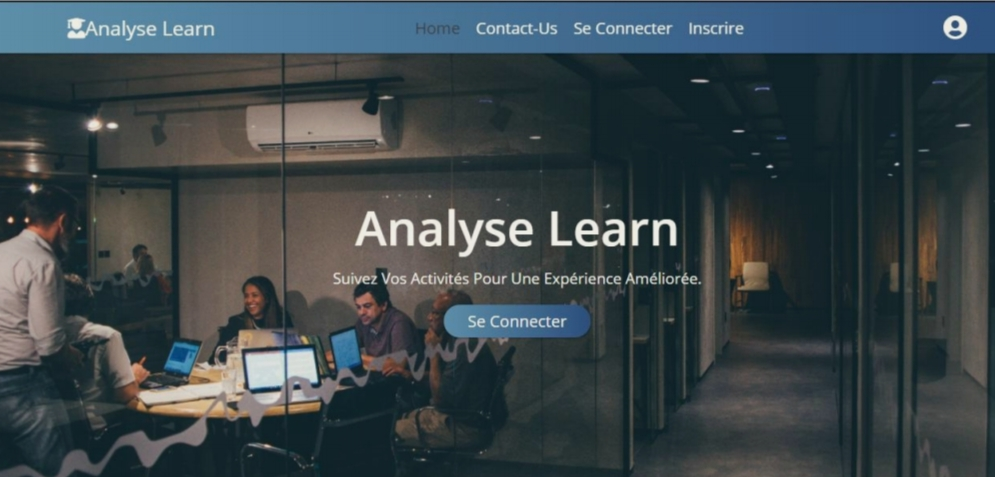
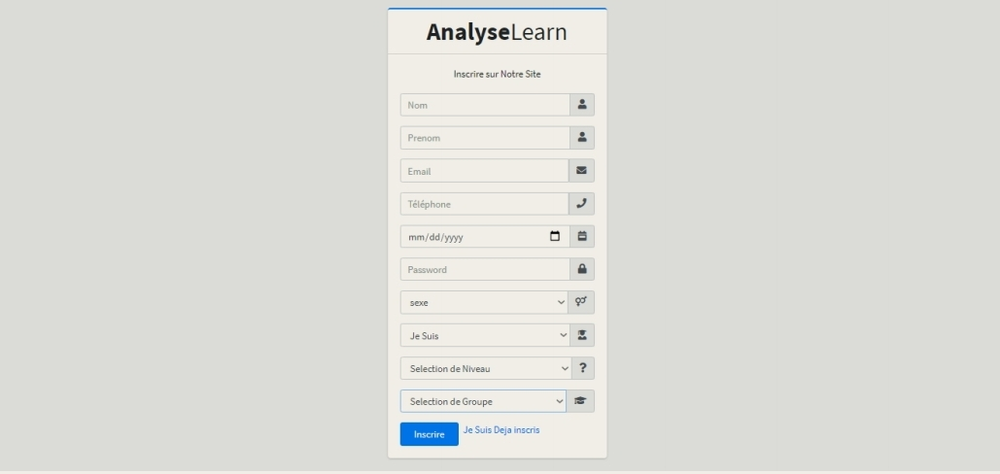
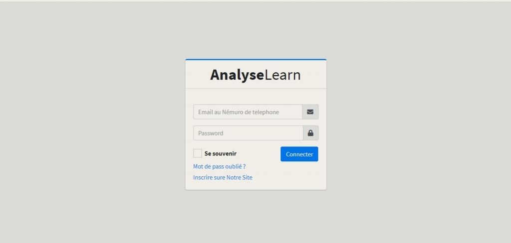
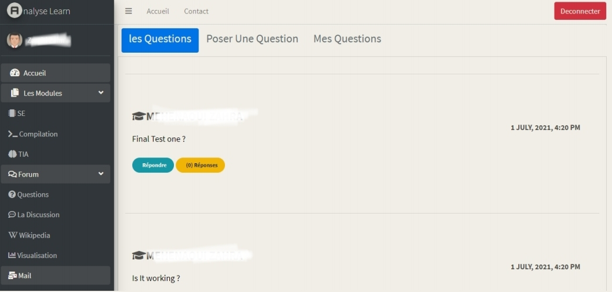
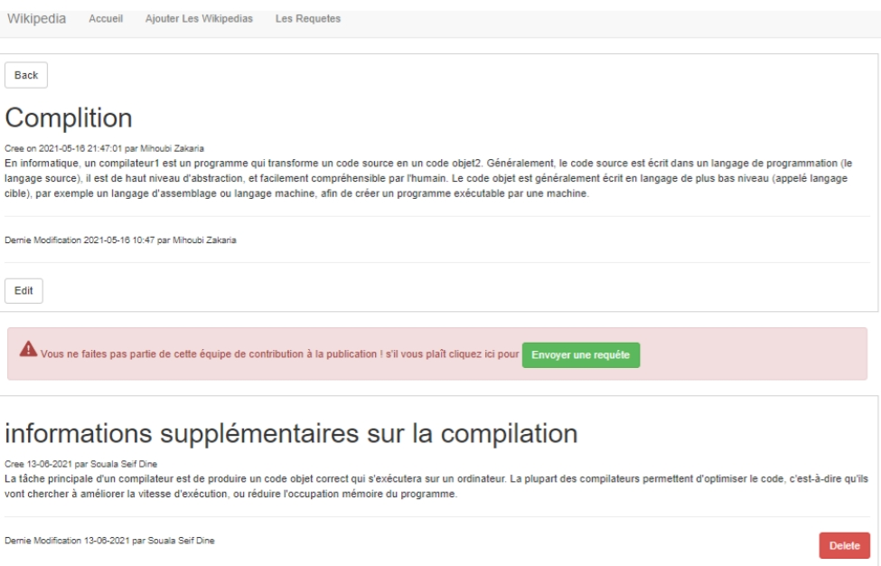
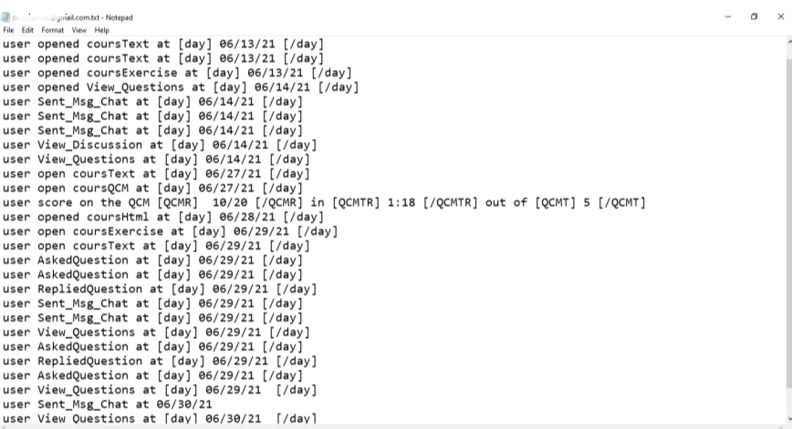
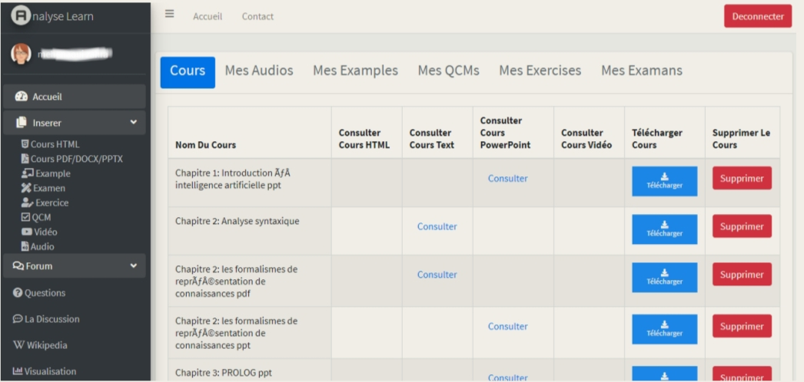
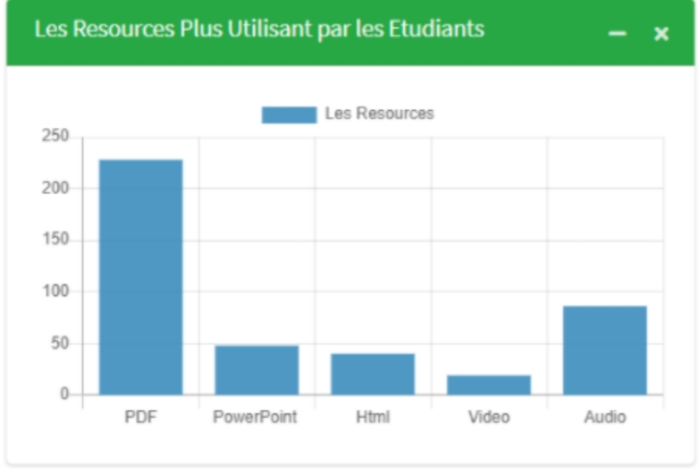
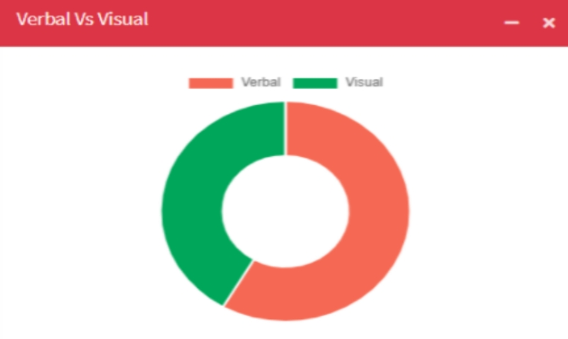

# AnalyseLearn

**An eLearning platform designed to track and classify user activities using the Felder-Silverman model.**

---

## Table of Contents
- [About the Project](#about-the-project)
- [Features](#features)
- [Screenshots](#screenshots)
- [Technologies Used](#technologies-used)
- [Disclaimer](#disclaimer)
- [Contact](#contact)

---

## About the Project

AnalyseLearn is a powerful eLearning platform that utilizes the **Felder-Silverman model** to enhance education through activity tracking and classification. The platform provides visual analytics and actionable feedback for improved engagement and learning outcomes.

Key Highlights:
- Adopted by **1000+ users**, increasing engagement by **40%**.
- Improved lesson quality and student performance by **25%**.
- Tracks and classifies learning styles, offering personalized recommendations.

---

## Features

- **Home Page**: Welcomes users with an intuitive interface.
- **User Authentication**: Allows users to sign up and log in securely.
- **Student Dashboard**: Provides access to personalized resources and learning insights.
- **Collaboration Tools**: Includes integrated collaboration features like Wikipedia.
- **Personal Log Files**: Tracks individual learning activity and progress.
- **Teacher Dashboard**: Offers analytics on student performance and activity.
- **Analytics**: Displays data on the most used resources.
- **Felder-Silverman Classification**: Categorizes students’ learning preferences (e.g., Visual vs. Verbal).

---

## Screenshots

### Home Page
_The welcoming homepage with an intuitive interface._

### Signup and Login
_Secure signup and login interface for users._

### Student Account View
_Student dashboard with personalized resources._

### Collab Wikipedia
_An integrated collaborative Wikipedia feature for shared learning._

### Personal Log File
_A detailed log file tracking individual student activity._

### Teacher Account View
_Teacher dashboard with lessons, resource management, performance metrics and insights._

### Analytics: Most Used Resources
_Analytics displaying the most accessed learning resources._

### Example of Felder-Silverman Classification (Visual vs Verbal)
_A detailed breakdown of students' learning styles (Visual vs Verbal)._

---

## Technologies Used

- **Backend**: PHP, MySQL
- **Frontend**: jQuery, Bootstrap CSS, Chart.js
- **Other**: Felder-Silverman model for activity tracking and classification

---

## Disclaimer

This project was previously hosted online but is no longer live. The source code is proprietary and owned by the client; therefore, it cannot be shared publicly. The screenshots and descriptions provided here are for showcasing the project's features and implementation details only.

---

## Contact

For questions or further information, contact:  
**Name**: Mihoubi Zakaria  
**Email**: mihoubi.zakaria.dev@gmail.com
